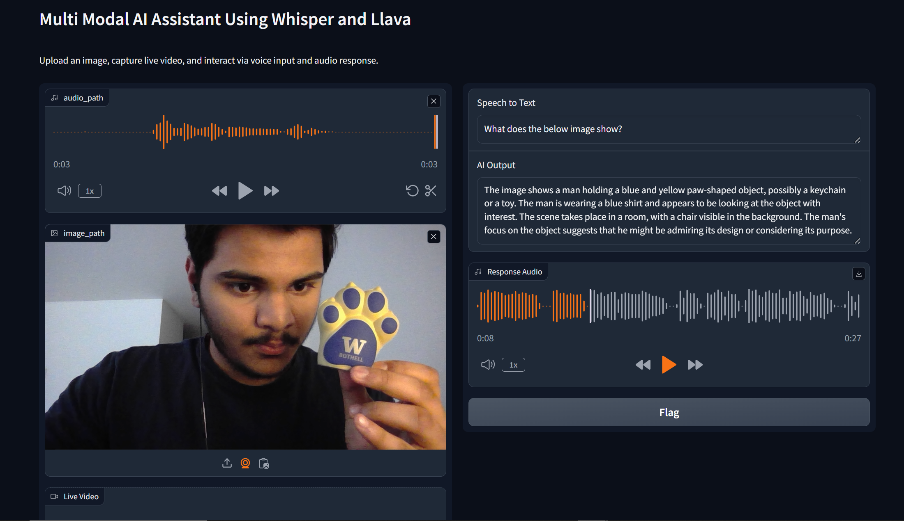

# Multimodal AI Assistant



The Multimodal AI Assistant is an advanced tool designed to bridge the gap between human and computer interaction. Utilizing the power of **`OpenAI's Whisper`** and **`LLaVa-7B`** models, this assistant provides a seamless experience, processing audio and visual inputs to deliver insightful and context-aware responses. This guide will help you set up and explore the full capabilities of the Multimodal AI Assistant.

Access the Multimodal AI Assistant here: [MultimodalAIAssistant](your-app-link.com)


## Table of Contents

- [Introduction](#multimodal-ai-assistant)
- [Table of Contents](#table-of-contents)
- [Prerequisites](#prerequisites)
- [Installation](#installation)
- [Getting Started](#getting-started)
- [Usage](#usage)
- [Features](#features)
- [Contributing](#contributing)
- [License](#license)

## Prerequisites

Ensure you have the following prerequisites installed on your machine before starting with the Multimodal AI Assistant:

- `Python 3.10` or higher
- `Gradio` library
- `PyTorch` and `Transformers` libraries
- `Whisper` model from OpenAI
- `gTTS` for text-to-speech conversion
- `OpenCV` for video frame processing

## Installation

Follow these steps to install and set up the Multimodal AI Assistant:

1. Clone the repository to your local machine (use the actual repository link):

    ```bash
    git clone https://github.com/TVR28/Multimodal-AI-Assistant.git
    cd Multimodal-AI-Assistant
    ```

2. Install the required Python libraries:

    ```bash
    pip install -r requirements.txt
    ```

## Getting Started

To get started, run the application script after installation:

```bash
python multimodal_ai_assistant.py
```

or run the google colab  `Multimodal_AI_Assistant_Llava7B.ipynb` notebook with a T4 GPU.
## Usage

The Multimodal AI Assistant provides an interactive interface for users to engage with AI through voice and images:

- **Voice Interaction**: Record your query directly through the microphone input.
- **Image Analysis**: Upload or capture an image to receive a detailed description of its content.
- **Video Frame Analysis**: Capture live video and the assistant will analyze specific frames to answer your questions.

## Features

- **Voice to Text Transcription**: Transcribes user voice input with Whisper.
- **Image to Text Description**: Generates descriptive text for images using the LLaVa model.
- **Text to Speech Response**: Converts AI-generated text into audible speech.
- **Video Frame Extraction**: Captures frames from live video for analysis.

## Contributing

We welcome contributions to the Multimodal AI Assistant. Please follow these steps to contribute:

1. Fork the repository.
2. Create a new branch for your feature.
3. Add your feature or bug fix.
4. Push your code and open a new pull request.
